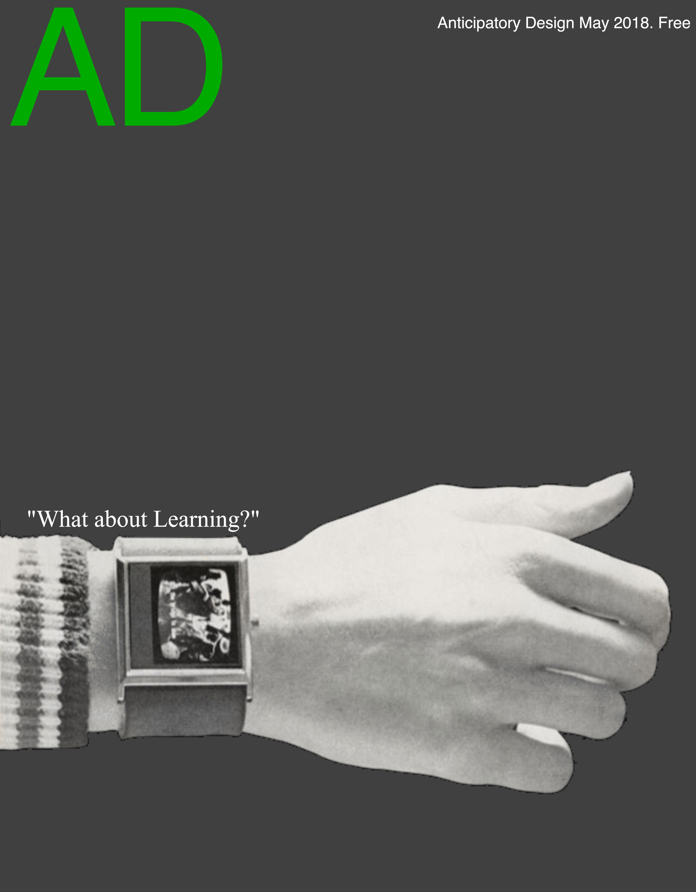
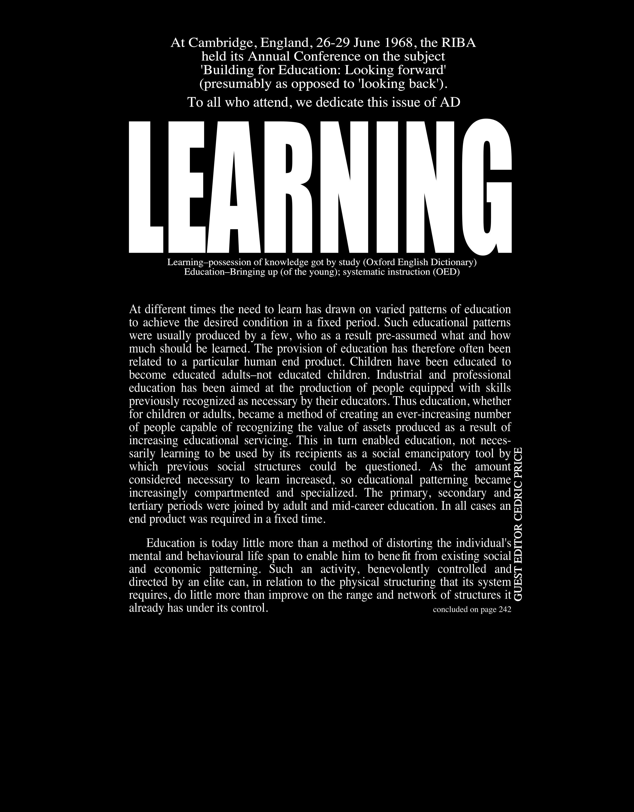

  atom 

ATOM: Design for new learning for a new town
============================================

[Repository](https://github.com/Archiblog/atom)
===============================================

• Facsimile of the [cover](https://github.com/Archiblog/atom/blob/main/facsimiles/cover.png) of AD 5/68

▪ Click [here](https://github.com/Archiblog/atom/blob/main/docs/Price%2C%20C.%20(1968)%20Atom.pdf) to read the Atom article by Cedric Price

[Learn More](https://www.designingbuildings.co.uk/wiki/ATOM:_A_generating_system_designed_by_Cedric_Price) [PDF](https://github.com/Archiblog/atom/blob/main/docs/Price%2C%20C.%20(1967)%20Atomia.pdf)

• Facsimile of the [editorial by Cedric Price](https://github.com/Archiblog/atom/blob/main/facsimiles/page-207.png) in AD 5/68

▪ Click [here](https://github.com/Archiblog/atom/blob/main/facsimiles/page-242.png) to read the editorial continued

[Learn More](#) [PDF](#)

**nb** Both [documents](#) are in PDF form and can therefore be downloaded.
